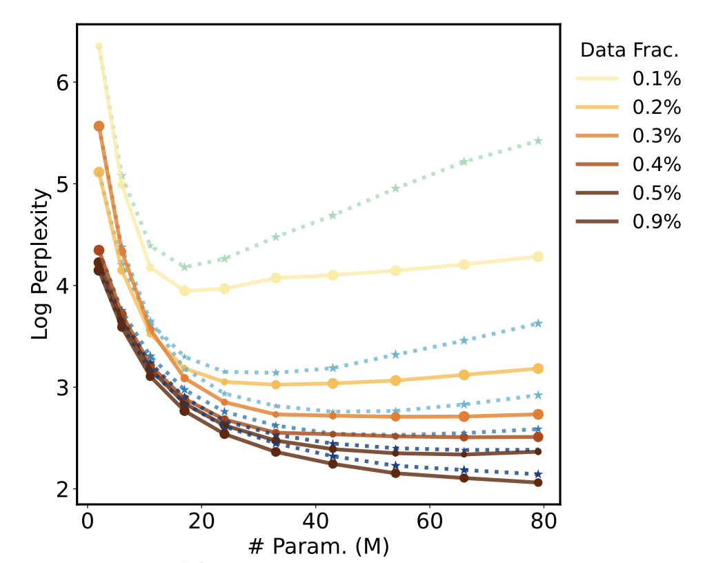

# Data Efficient Neural Scaling Law via Model Reusing


[](https://opensource.org/licenses/MIT)


The official implementation of ICML 2023 paper [Data Efficient Neural Scaling Law via Model Reusing](https://openreview.net/pdf?id=iXYnIz4RRx).

Peihao Wang, Rameswar Panda, Zhangyang (Atlas) Wang

This repository is based on the project [Vokenization](https://github.com/airsplay/vokenization#vokenization-vokenization).



## Introduction

The number of parameters in large transformers has been observed to grow exponentially. Despite notable performance improvements, concerns have been raised that such a growing model size will run out of data in the near future. As manifested in the neural scaling law, modern learning backbones are not data-efficient. To maintain the utility of the model capacity, training data should be increased proportionally. In this paper, we study the neural scaling law under the previously overlooked data scarcity regime, focusing on the more challenging situation where we need to train a gigantic model with a disproportionately limited supply of available training data. We find that the existing power laws underestimate the data inefficiency of large transformers. Their performance will drop significantly if the training set is insufficient. Fortunately, we discover another blessing - such a data-inefficient scaling law can be restored through a model reusing approach that warm-starts the training of a large model by initializing it using smaller models. Our empirical study shows that model reusing can effectively reproduce the power law under the data scarcity regime. When progressively applying model reusing to expand the model size, we also observe consistent performance improvement in large transformers.

## Getting Started


### Dependency

To run our code, the following Python libraries which are required to run our code:

```
torch
torchvision
transformers==4.21.0
tensorboardX

# For GLUE evaluation
sklearn

# Fiass supports fast indexing.
# The code has a torch-implemented GPU indexing, so do not worry if you could not install faiss.
faiss-gpu>=1.6.3

# Spacy is used in sentence segmentation where the sentences are the input the cross-modality matching model.
spacy

# A higher h5py version to support h5py.VirtualLayout
h5py>=2.10.0

# For plotting
matplotlib
```

### Data Preparation

We re-use the data preparation pipeline provided by [Vokenization](https://github.com/airsplay/vokenization#vokenization-vokenization).

**1. Download and Pre-Process Pure-Language Data**

We provide scripts to get the English-Wikipeida dataset.

The script to download and process wiki data are modified from [XLM](https://github.com/facebookresearch/XLM). Note that the data processing pipelines for BERT and RoBERTa are different as they use different tokenizers.

To get data for training BERT, use the following command:
```
bash data/wiki/get_data_cased.bash en
```

For RoBERTa, it requires an untokenized version of English Wikipedia, so please use the following command:
```
bash data/wiki/get_data_cased_untokenized.bash en
```

**2. Tokenize Language Data**

We next tokenize the language corpus. It would locally save three files: `<dataset_name>.<tokenizer_name>`, `<dataset_name>.<tokenizer_name>.hdf5`, and `<dataset_name>.<tokenizer_name>.line`.
Use the following commands accordingly to tokenize the dataset:

```
# For BERT
bash tokenization/tokenize_wiki_bert.bash

# For RoBERTa
bash tokenization/tokenize_wiki_roberta.bash 
```

You will only need `en.valid.raw.bert-uncased.hdf5` to reproduce results in our paper.

## Reproducing Curves

**1. Download Pre-Trained Checkpoints**

We release our pre-trained checkpoints at this [Huggingface Hub](https://huggingface.co/peihaowang/data-efficient-scaling). You may download it via the following command:
```
git clone https://huggingface.co/peihaowang/data-efficient-scaling
```

**2. Run Jupyter Notebook**

We provide Jupyter Notebook `plot_curves.ipynb` to evaluate all checkpoints and plot curves. You will need to specify the following arguments (with default values below) before running it:
```
# random seed and GPU ID
seed = 0 
gpu = 0

# path to the prepared evaluation dataset
eval_data_file = 'data/wiki-cased/en.valid.raw'

# path to the folder holding checkpointed downloaded from the huggingface hub
checkpoints_path = './data-efficient-scaling/'

# evaluation batch size, adjust according to memory limit
batch_size = 64
```

## Citation

If you find this work or our work helpful for your own research, please cite our paper.

```
@inproceedings{wang2023data,
  title={Data efficient neural scaling law via model reusing},
  author={Wang, Peihao and Panda, Rameswar and Wang, Zhangyang},
  booktitle={International Conference on Machine Learning},
  pages={36193--36204},
  year={2023},
  organization={PMLR}
}
```
